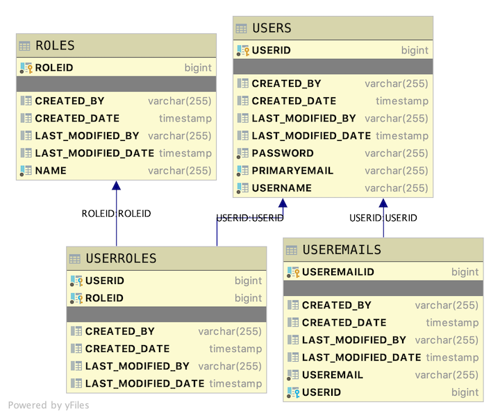

# Java User Model Final Version for OAuth2 Security

## Introduction

This is a basic database scheme with users, user emails, and user roles. This Java Spring REST API application will provide endpoints for clients to perform the various CRUD operations on data sets contained in the application's data.

### Database layout

The table layout is as follows

- User is the driving table.
- Useremails have a Many-To-One relationship with User. Each User has many user email combinations. Each user email combination has only one User.
- Roles have a Many-To-Many relationship with Users.



### Using the provided seed data, expand each endpoint below to see the output it generates. Run with user **admin** who has roles ADMIN, USER, DATA

<details>
<summary>http://localhost:2019/useremails/useremails</summary>

```JSON
[
    {
        "useremailid": 5,
        "useremail": "admin@email.local",
        "user": {
            "userid": 4,
            "username": "admin",
            "primaryemail": "admin@lambdaschool.local",
            "roles": [
                {
                    "role": {
                        "roleid": 1,
                        "name": "ADMIN"
                    }
                },
                {
                    "role": {
                        "roleid": 2,
                        "name": "USER"
                    }
                },
                {
                    "role": {
                        "roleid": 3,
                        "name": "DATA"
                    }
                }
            ]
        }
    },
    {
        "useremailid": 6,
        "useremail": "admin@mymail.local",
        "user": {
            "userid": 4,
            "username": "admin",
            "primaryemail": "admin@lambdaschool.local",
            "roles": [
                {
                    "role": {
                        "roleid": 1,
                        "name": "ADMIN"
                    }
                },
                {
                    "role": {
                        "roleid": 2,
                        "name": "USER"
                    }
                },
                {
                    "role": {
                        "roleid": 3,
                        "name": "DATA"
                    }
                }
            ]
        }
    },
    {
        "useremailid": 8,
        "useremail": "cinnamon@mymail.local",
        "user": {
            "userid": 7,
            "username": "cinnamon",
            "primaryemail": "cinnamon@lambdaschool.local",
            "roles": [
                {
                    "role": {
                        "roleid": 3,
                        "name": "DATA"
                    }
                },
                {
                    "role": {
                        "roleid": 2,
                        "name": "USER"
                    }
                }
            ]
        }
    },
    {
        "useremailid": 9,
        "useremail": "hops@mymail.local",
        "user": {
            "userid": 7,
            "username": "cinnamon",
            "primaryemail": "cinnamon@lambdaschool.local",
            "roles": [
                {
                    "role": {
                        "roleid": 3,
                        "name": "DATA"
                    }
                },
                {
                    "role": {
                        "roleid": 2,
                        "name": "USER"
                    }
                }
            ]
        }
    },
    {
        "useremailid": 10,
        "useremail": "bunny@email.local",
        "user": {
            "userid": 7,
            "username": "cinnamon",
            "primaryemail": "cinnamon@lambdaschool.local",
            "roles": [
                {
                    "role": {
                        "roleid": 3,
                        "name": "DATA"
                    }
                },
                {
                    "role": {
                        "roleid": 2,
                        "name": "USER"
                    }
                }
            ]
        }
    },
    {
        "useremailid": 12,
        "useremail": "barnbarn@email.local",
        "user": {
            "userid": 11,
            "username": "barnbarn",
            "primaryemail": "barnbarn@lambdaschool.local",
            "roles": [
                {
                    "role": {
                        "roleid": 2,
                        "name": "USER"
                    }
                }
            ]
        }
    },
    {
        "useremailid": 16,
        "useremail": "ctvw90@gmail.com",
        "user": {
            "userid": 15,
            "username": "casandra.ferry",
            "primaryemail": "lorelei.schowalter@hotmail.com",
            "roles": [
                {
                    "role": {
                        "roleid": 2,
                        "name": "USER"
                    }
                }
            ]
        }
    },
    {
        "useremailid": 18,
        "useremail": "egax45@gmail.com",
        "user": {
            "userid": 17,
            "username": "theron.kris",
            "primaryemail": "della.gusikowski@gmail.com",
            "roles": [
                {
                    "role": {
                        "roleid": 2,
                        "name": "USER"
                    }
                }
            ]
        }
    },
    {
        "useremailid": 20,
        "useremail": "gfgh16@gmail.com",
        "user": {
            "userid": 19,
            "username": "frankie.pfannerstill",
            "primaryemail": "jill.hills@yahoo.com",
            "roles": [
                {
                    "role": {
                        "roleid": 2,
                        "name": "USER"
                    }
                }
            ]
        }
    },
    {
        "useremailid": 22,
        "useremail": "mnib90@gmail.com",
        "user": {
            "userid": 21,
            "username": "sherita.fritsch",
            "primaryemail": "hector.ullrich@hotmail.com",
            "roles": [
                {
                    "role": {
                        "roleid": 2,
                        "name": "USER"
                    }
                }
            ]
        }
    },
    {
        "useremailid": 24,
        "useremail": "ghij44@gmail.com",
        "user": {
            "userid": 23,
            "username": "randolph.hayes",
            "primaryemail": "vinita.goyette@gmail.com",
            "roles": [
                {
                    "role": {
                        "roleid": 2,
                        "name": "USER"
                    }
                }
            ]
        }
    },
    {
        "useremailid": 26,
        "useremail": "uuay82@gmail.com",
        "user": {
            "userid": 25,
            "username": "tenesha.witting",
            "primaryemail": "iris.nienow@gmail.com",
            "roles": [
                {
                    "role": {
                        "roleid": 2,
                        "name": "USER"
                    }
                }
            ]
        }
    },
    {
        "useremailid": 28,
        "useremail": "jgps57@gmail.com",
        "user": {
            "userid": 27,
            "username": "myles.harvey",
            "primaryemail": "devin.ondricka@hotmail.com",
            "roles": [
                {
                    "role": {
                        "roleid": 2,
                        "name": "USER"
                    }
                }
            ]
        }
    },
    {
        "useremailid": 30,
        "useremail": "ckmr36@gmail.com",
        "user": {
            "userid": 29,
            "username": "jesus.gislason",
            "primaryemail": "teddy.vandervort@yahoo.com",
            "roles": [
                {
                    "role": {
                        "roleid": 2,
                        "name": "USER"
                    }
                }
            ]
        }
    },
    {
        "useremailid": 32,
        "useremail": "vfsm59@gmail.com",
        "user": {
            "userid": 31,
            "username": "nohemi.bailey",
            "primaryemail": "mica.schiller@yahoo.com",
            "roles": [
                {
                    "role": {
                        "roleid": 2,
                        "name": "USER"
                    }
                }
            ]
        }
    },
    {
        "useremailid": 34,
        "useremail": "yqzk72@gmail.com",
        "user": {
            "userid": 33,
            "username": "jacinda.goyette",
            "primaryemail": "eldon.zieme@gmail.com",
            "roles": [
                {
                    "role": {
                        "roleid": 2,
                        "name": "USER"
                    }
                }
            ]
        }
    },
    {
        "useremailid": 36,
        "useremail": "uzaa97@gmail.com",
        "user": {
            "userid": 35,
            "username": "sharonda.spencer",
            "primaryemail": "leandro.schulist@gmail.com",
            "roles": [
                {
                    "role": {
                        "roleid": 2,
                        "name": "USER"
                    }
                }
            ]
        }
    },
    {
        "useremailid": 38,
        "useremail": "ddmw44@gmail.com",
        "user": {
            "userid": 37,
            "username": "emmaline.krajcik",
            "primaryemail": "lianne.carter@hotmail.com",
            "roles": [
                {
                    "role": {
                        "roleid": 2,
                        "name": "USER"
                    }
                }
            ]
        }
    },
    {
        "useremailid": 40,
        "useremail": "ovfc27@gmail.com",
        "user": {
            "userid": 39,
            "username": "eun.aufderhar",
            "primaryemail": "king.wilderman@hotmail.com",
            "roles": [
                {
                    "role": {
                        "roleid": 2,
                        "name": "USER"
                    }
                }
            ]
        }
    },
    {
        "useremailid": 42,
        "useremail": "yate24@gmail.com",
        "user": {
            "userid": 41,
            "username": "efrain.emard",
            "primaryemail": "marci.christiansen@hotmail.com",
            "roles": [
                {
                    "role": {
                        "roleid": 2,
                        "name": "USER"
                    }
                }
            ]
        }
    },
    {
        "useremailid": 44,
        "useremail": "dwxh79@gmail.com",
        "user": {
            "userid": 43,
            "username": "carlton.kunde",
            "primaryemail": "luke.legros@gmail.com",
            "roles": [
                {
                    "role": {
                        "roleid": 2,
                        "name": "USER"
                    }
                }
            ]
        }
    },
    {
        "useremailid": 46,
        "useremail": "cdih82@gmail.com",
        "user": {
            "userid": 45,
            "username": "tania.hintz",
            "primaryemail": "eli.vonrueden@yahoo.com",
            "roles": [
                {
                    "role": {
                        "roleid": 2,
                        "name": "USER"
                    }
                }
            ]
        }
    },
    {
        "useremailid": 48,
        "useremail": "lvqh39@gmail.com",
        "user": {
            "userid": 47,
            "username": "nickolas.beahan",
            "primaryemail": "raelene.brakus@hotmail.com",
            "roles": [
                {
                    "role": {
                        "roleid": 2,
                        "name": "USER"
                    }
                }
            ]
        }
    },
    {
        "useremailid": 50,
        "useremail": "busr02@gmail.com",
        "user": {
            "userid": 49,
            "username": "clifton.swift",
            "primaryemail": "luther.welch@hotmail.com",
            "roles": [
                {
                    "role": {
                        "roleid": 2,
                        "name": "USER"
                    }
                }
            ]
        }
    },
    {
        "useremailid": 52,
        "useremail": "tfjm31@gmail.com",
        "user": {
            "userid": 51,
            "username": "fredric.predovic",
            "primaryemail": "muoi.herzog@yahoo.com",
            "roles": [
                {
                    "role": {
                        "roleid": 2,
                        "name": "USER"
                    }
                }
            ]
        }
    },
    {
        "useremailid": 54,
        "useremail": "yhaz21@gmail.com",
        "user": {
            "userid": 53,
            "username": "odessa.boehm",
            "primaryemail": "lavonda.flatley@yahoo.com",
            "roles": [
                {
                    "role": {
                        "roleid": 2,
                        "name": "USER"
                    }
                }
            ]
        }
    },
    {
        "useremailid": 56,
        "useremail": "hqvc95@gmail.com",
        "user": {
            "userid": 55,
            "username": "latisha.schroeder",
            "primaryemail": "luise.kutch@yahoo.com",
            "roles": [
                {
                    "role": {
                        "roleid": 2,
                        "name": "USER"
                    }
                }
            ]
        }
    },
    {
        "useremailid": 58,
        "useremail": "jcyr62@gmail.com",
        "user": {
            "userid": 57,
            "username": "imelda.predovic",
            "primaryemail": "daniell.denesik@gmail.com",
            "roles": [
                {
                    "role": {
                        "roleid": 2,
                        "name": "USER"
                    }
                }
            ]
        }
    },
    {
        "useremailid": 60,
        "useremail": "suyn40@gmail.com",
        "user": {
            "userid": 59,
            "username": "lashandra.halvorson",
            "primaryemail": "ronna.kunde@yahoo.com",
            "roles": [
                {
                    "role": {
                        "roleid": 2,
                        "name": "USER"
                    }
                }
            ]
        }
    },
    {
        "useremailid": 62,
        "useremail": "spxi01@gmail.com",
        "user": {
            "userid": 61,
            "username": "joesph.schmitt",
            "primaryemail": "lucius.quitzon@yahoo.com",
            "roles": [
                {
                    "role": {
                        "roleid": 2,
                        "name": "USER"
                    }
                }
            ]
        }
    },
    {
        "useremailid": 64,
        "useremail": "ivsl91@gmail.com",
        "user": {
            "userid": 63,
            "username": "hans.kunze",
            "primaryemail": "roselee.zboncak@gmail.com",
            "roles": [
                {
                    "role": {
                        "roleid": 2,
                        "name": "USER"
                    }
                }
            ]
        }
    }
]
```

</details>
<details>
<summary>http://localhost:2019/useremails/useremail/8</summary>

```JSON
{
    "useremailid": 8,
    "useremail": "cinnamon@mymail.local",
    "user": {
        "userid": 7,
        "username": "cinnamon",
        "primaryemail": "cinnamon@lambdaschool.local",
        "roles": [
            {
                "role": {
                    "roleid": 3,
                    "name": "DATA"
                }
            },
            {
                "role": {
                    "roleid": 2,
                    "name": "USER"
                }
            }
        ]
    }
}
```

</details>

<details>
<summary>http://localhost:2019/useremails/useremail/8888</summary>

```JSON
{
    "title": "Resource Not Found",
    "status": 404,
    "detail": "Error from a Lambda School Application Useremail with id 8888 Not Found!",
    "timestamp": "2020-04-24 17:52:18",
    "developerMessage": "com.lambdaschool.foundation.exceptions.ResourceNotFoundException",
    "errors": []
}
```

</details>

<details>
<summary>DELETE http://localhost:2019/useremails/useremail/8</summary>

```TEXT
No Body Data

Status OK
```

</details>

<details>
<summary>PUT http://localhost:2019/useremails/useremail/9/email/favbun@hops.local</summary>

```TEXT
No Body Data

Status OK
```

</details>

<details>
<summary>POST http://localhost:2019/useremails/user/15/email/favbun@hops.local</summary>

```TEXT
No Body Data

Location Header: http://localhost:2019/useremails/useremail/65
Status CREATED
```

</details>

<details>
<summary>http://localhost:2019/useremails/username/cinnamon</summary>

```JSON
[
    {
        "useremailid": 9,
        "useremail": "favbun@hops.local",
        "user": {
            "userid": 7,
            "username": "cinnamon",
            "primaryemail": "cinnamon@lambdaschool.local",
            "roles": [
                {
                    "role": {
                        "roleid": 3,
                        "name": "DATA"
                    }
                },
                {
                    "role": {
                        "roleid": 2,
                        "name": "USER"
                    }
                }
            ]
        }
    },
    {
        "useremailid": 10,
        "useremail": "bunny@email.local",
        "user": {
            "userid": 7,
            "username": "cinnamon",
            "primaryemail": "cinnamon@lambdaschool.local",
            "roles": [
                {
                    "role": {
                        "roleid": 3,
                        "name": "DATA"
                    }
                },
                {
                    "role": {
                        "roleid": 2,
                        "name": "USER"
                    }
                }
            ]
        }
    }
]
```

</details>

---

<details>
<summary>http://localhost:2019/roles/roles</summary>

```JSON
[
    {
        "roleid": 1,
        "name": "ADMIN",
        "users": [
            {
                "user": {
                    "userid": 4,
                    "username": "admin",
                    "primaryemail": "admin@lambdaschool.local",
                    "useremails": [
                        {
                            "useremailid": 5,
                            "useremail": "admin@email.local"
                        },
                        {
                            "useremailid": 6,
                            "useremail": "admin@mymail.local"
                        }
                    ]
                }
            }
        ]
    },
    {
        "roleid": 2,
        "name": "USER",
        "users": [
            {
                "user": {
                    "userid": 4,
                    "username": "admin",
                    "primaryemail": "admin@lambdaschool.local",
                    "useremails": [
                        {
                            "useremailid": 5,
                            "useremail": "admin@email.local"
                        },
                        {
                            "useremailid": 6,
                            "useremail": "admin@mymail.local"
                        }
                    ]
                }
            },
            {
                "user": {
                    "userid": 7,
                    "username": "cinnamon",
                    "primaryemail": "cinnamon@lambdaschool.local",
                    "useremails": [
                        {
                            "useremailid": 9,
                            "useremail": "favbun@hops.local"
                        },
                        {
                            "useremailid": 10,
                            "useremail": "bunny@email.local"
                        }
                    ]
                }
            },
            {
                "user": {
                    "userid": 11,
                    "username": "barnbarn",
                    "primaryemail": "barnbarn@lambdaschool.local",
                    "useremails": [
                        {
                            "useremailid": 12,
                            "useremail": "barnbarn@email.local"
                        }
                    ]
                }
            },
            {
                "user": {
                    "userid": 13,
                    "username": "puttat",
                    "primaryemail": "puttat@school.lambda",
                    "useremails": []
                }
            },
            {
                "user": {
                    "userid": 14,
                    "username": "misskitty",
                    "primaryemail": "misskitty@school.lambda",
                    "useremails": []
                }
            },
            {
                "user": {
                    "userid": 15,
                    "username": "casandra.ferry",
                    "primaryemail": "lorelei.schowalter@hotmail.com",
                    "useremails": [
                        {
                            "useremailid": 16,
                            "useremail": "ctvw90@gmail.com"
                        },
                        {
                            "useremailid": 65,
                            "useremail": "favbun@hops.local"
                        }
                    ]
                }
            },
            {
                "user": {
                    "userid": 17,
                    "username": "theron.kris",
                    "primaryemail": "della.gusikowski@gmail.com",
                    "useremails": [
                        {
                            "useremailid": 18,
                            "useremail": "egax45@gmail.com"
                        }
                    ]
                }
            },
            {
                "user": {
                    "userid": 19,
                    "username": "frankie.pfannerstill",
                    "primaryemail": "jill.hills@yahoo.com",
                    "useremails": [
                        {
                            "useremailid": 20,
                            "useremail": "gfgh16@gmail.com"
                        }
                    ]
                }
            },
            {
                "user": {
                    "userid": 21,
                    "username": "sherita.fritsch",
                    "primaryemail": "hector.ullrich@hotmail.com",
                    "useremails": [
                        {
                            "useremailid": 22,
                            "useremail": "mnib90@gmail.com"
                        }
                    ]
                }
            },
            {
                "user": {
                    "userid": 23,
                    "username": "randolph.hayes",
                    "primaryemail": "vinita.goyette@gmail.com",
                    "useremails": [
                        {
                            "useremailid": 24,
                            "useremail": "ghij44@gmail.com"
                        }
                    ]
                }
            },
            {
                "user": {
                    "userid": 25,
                    "username": "tenesha.witting",
                    "primaryemail": "iris.nienow@gmail.com",
                    "useremails": [
                        {
                            "useremailid": 26,
                            "useremail": "uuay82@gmail.com"
                        }
                    ]
                }
            },
            {
                "user": {
                    "userid": 27,
                    "username": "myles.harvey",
                    "primaryemail": "devin.ondricka@hotmail.com",
                    "useremails": [
                        {
                            "useremailid": 28,
                            "useremail": "jgps57@gmail.com"
                        }
                    ]
                }
            },
            {
                "user": {
                    "userid": 29,
                    "username": "jesus.gislason",
                    "primaryemail": "teddy.vandervort@yahoo.com",
                    "useremails": [
                        {
                            "useremailid": 30,
                            "useremail": "ckmr36@gmail.com"
                        }
                    ]
                }
            },
            {
                "user": {
                    "userid": 31,
                    "username": "nohemi.bailey",
                    "primaryemail": "mica.schiller@yahoo.com",
                    "useremails": [
                        {
                            "useremailid": 32,
                            "useremail": "vfsm59@gmail.com"
                        }
                    ]
                }
            },
            {
                "user": {
                    "userid": 33,
                    "username": "jacinda.goyette",
                    "primaryemail": "eldon.zieme@gmail.com",
                    "useremails": [
                        {
                            "useremailid": 34,
                            "useremail": "yqzk72@gmail.com"
                        }
                    ]
                }
            },
            {
                "user": {
                    "userid": 35,
                    "username": "sharonda.spencer",
                    "primaryemail": "leandro.schulist@gmail.com",
                    "useremails": [
                        {
                            "useremailid": 36,
                            "useremail": "uzaa97@gmail.com"
                        }
                    ]
                }
            },
            {
                "user": {
                    "userid": 37,
                    "username": "emmaline.krajcik",
                    "primaryemail": "lianne.carter@hotmail.com",
                    "useremails": [
                        {
                            "useremailid": 38,
                            "useremail": "ddmw44@gmail.com"
                        }
                    ]
                }
            },
            {
                "user": {
                    "userid": 39,
                    "username": "eun.aufderhar",
                    "primaryemail": "king.wilderman@hotmail.com",
                    "useremails": [
                        {
                            "useremailid": 40,
                            "useremail": "ovfc27@gmail.com"
                        }
                    ]
                }
            },
            {
                "user": {
                    "userid": 41,
                    "username": "efrain.emard",
                    "primaryemail": "marci.christiansen@hotmail.com",
                    "useremails": [
                        {
                            "useremailid": 42,
                            "useremail": "yate24@gmail.com"
                        }
                    ]
                }
            },
            {
                "user": {
                    "userid": 43,
                    "username": "carlton.kunde",
                    "primaryemail": "luke.legros@gmail.com",
                    "useremails": [
                        {
                            "useremailid": 44,
                            "useremail": "dwxh79@gmail.com"
                        }
                    ]
                }
            },
            {
                "user": {
                    "userid": 45,
                    "username": "tania.hintz",
                    "primaryemail": "eli.vonrueden@yahoo.com",
                    "useremails": [
                        {
                            "useremailid": 46,
                            "useremail": "cdih82@gmail.com"
                        }
                    ]
                }
            },
            {
                "user": {
                    "userid": 47,
                    "username": "nickolas.beahan",
                    "primaryemail": "raelene.brakus@hotmail.com",
                    "useremails": [
                        {
                            "useremailid": 48,
                            "useremail": "lvqh39@gmail.com"
                        }
                    ]
                }
            },
            {
                "user": {
                    "userid": 49,
                    "username": "clifton.swift",
                    "primaryemail": "luther.welch@hotmail.com",
                    "useremails": [
                        {
                            "useremailid": 50,
                            "useremail": "busr02@gmail.com"
                        }
                    ]
                }
            },
            {
                "user": {
                    "userid": 51,
                    "username": "fredric.predovic",
                    "primaryemail": "muoi.herzog@yahoo.com",
                    "useremails": [
                        {
                            "useremailid": 52,
                            "useremail": "tfjm31@gmail.com"
                        }
                    ]
                }
            },
            {
                "user": {
                    "userid": 53,
                    "username": "odessa.boehm",
                    "primaryemail": "lavonda.flatley@yahoo.com",
                    "useremails": [
                        {
                            "useremailid": 54,
                            "useremail": "yhaz21@gmail.com"
                        }
                    ]
                }
            },
            {
                "user": {
                    "userid": 55,
                    "username": "latisha.schroeder",
                    "primaryemail": "luise.kutch@yahoo.com",
                    "useremails": [
                        {
                            "useremailid": 56,
                            "useremail": "hqvc95@gmail.com"
                        }
                    ]
                }
            },
            {
                "user": {
                    "userid": 57,
                    "username": "imelda.predovic",
                    "primaryemail": "daniell.denesik@gmail.com",
                    "useremails": [
                        {
                            "useremailid": 58,
                            "useremail": "jcyr62@gmail.com"
                        }
                    ]
                }
            },
            {
                "user": {
                    "userid": 59,
                    "username": "lashandra.halvorson",
                    "primaryemail": "ronna.kunde@yahoo.com",
                    "useremails": [
                        {
                            "useremailid": 60,
                            "useremail": "suyn40@gmail.com"
                        }
                    ]
                }
            },
            {
                "user": {
                    "userid": 61,
                    "username": "joesph.schmitt",
                    "primaryemail": "lucius.quitzon@yahoo.com",
                    "useremails": [
                        {
                            "useremailid": 62,
                            "useremail": "spxi01@gmail.com"
                        }
                    ]
                }
            },
            {
                "user": {
                    "userid": 63,
                    "username": "hans.kunze",
                    "primaryemail": "roselee.zboncak@gmail.com",
                    "useremails": [
                        {
                            "useremailid": 64,
                            "useremail": "ivsl91@gmail.com"
                        }
                    ]
                }
            }
        ]
    },
    {
        "roleid": 3,
        "name": "DATA",
        "users": [
            {
                "user": {
                    "userid": 4,
                    "username": "admin",
                    "primaryemail": "admin@lambdaschool.local",
                    "useremails": [
                        {
                            "useremailid": 5,
                            "useremail": "admin@email.local"
                        },
                        {
                            "useremailid": 6,
                            "useremail": "admin@mymail.local"
                        }
                    ]
                }
            },
            {
                "user": {
                    "userid": 7,
                    "username": "cinnamon",
                    "primaryemail": "cinnamon@lambdaschool.local",
                    "useremails": [
                        {
                            "useremailid": 9,
                            "useremail": "favbun@hops.local"
                        },
                        {
                            "useremailid": 10,
                            "useremail": "bunny@email.local"
                        }
                    ]
                }
            }
        ]
    }
]
```

</details>

<details>
<summary>http://localhost:2019/roles/role/3</summary>

```JSON
{
    "roleid": 3,
    "name": "DATA",
    "users": [
        {
            "user": {
                "userid": 4,
                "username": "admin",
                "primaryemail": "admin@lambdaschool.local",
                "useremails": [
                    {
                        "useremailid": 5,
                        "useremail": "admin@email.local"
                    },
                    {
                        "useremailid": 6,
                        "useremail": "admin@mymail.local"
                    }
                ]
            }
        },
        {
            "user": {
                "userid": 7,
                "username": "cinnamon",
                "primaryemail": "cinnamon@lambdaschool.local",
                "useremails": [
                    {
                        "useremailid": 9,
                        "useremail": "favbun@hops.local"
                    },
                    {
                        "useremailid": 10,
                        "useremail": "bunny@email.local"
                    }
                ]
            }
        }
    ]
}
```

</details>

<details>
<summary>http://localhost:2019/roles/role/name/data</summary>

```JSON
{
    "roleid": 3,
    "name": "DATA",
    "users": [
        {
            "user": {
                "userid": 4,
                "username": "admin",
                "primaryemail": "admin@lambdaschool.local",
                "useremails": [
                    {
                        "useremailid": 5,
                        "useremail": "admin@email.local"
                    },
                    {
                        "useremailid": 6,
                        "useremail": "admin@mymail.local"
                    }
                ]
            }
        },
        {
            "user": {
                "userid": 7,
                "username": "cinnamon",
                "primaryemail": "cinnamon@lambdaschool.local",
                "useremails": [
                    {
                        "useremailid": 9,
                        "useremail": "favbun@hops.local"
                    },
                    {
                        "useremailid": 10,
                        "useremail": "bunny@email.local"
                    }
                ]
            }
        }
    ]
}
```

</details>

<details>
<summary>POST http://localhost:2019/roles/role</summary>

DATA

```JSON
{
    "name" : "ANewRole"
}
```

OUTPUT

```TEXT
No Body Data

Location Headers: http://localhost:2019/roles/role/66
Status CREATED
```

</details>

<details>
<summary>DELETE localhost:2019/roles/role/3</summary>

```TEXT
No Body Data

Created OK
```

</details>

<details>
<summary>PUT http://localhost:2019/roles/role/66</summary>

DATA

```JSON
{
    "name" : "CORGI"
}
```

OUTPUT

```TEXT
No Body Data

Status OK
```

</details>

<details>
<summary>PATCH http://localhost:2019/roles/role/66</summary>

DATA

```JSON
{
    "name" : "MOJO"
}
```

OUTPUT

```TEXT
No Body Data

Status OK
```

</details>

---

<details>
<summary>http://localhost:2019/users/users</summary>

```JSON
[
    {
        "userid": 4,
        "username": "admin",
        "primaryemail": "admin@lambdaschool.local",
        "useremails": [
            {
                "useremailid": 5,
                "useremail": "admin@email.local"
            },
            {
                "useremailid": 6,
                "useremail": "admin@mymail.local"
            }
        ],
        "roles": [
            {
                "role": {
                    "roleid": 1,
                    "name": "ADMIN"
                }
            },
            {
                "role": {
                    "roleid": 2,
                    "name": "USER"
                }
            }
        ]
    },
    {
        "userid": 7,
        "username": "cinnamon",
        "primaryemail": "cinnamon@lambdaschool.local",
        "useremails": [
            {
                "useremailid": 9,
                "useremail": "favbun@hops.local"
            },
            {
                "useremailid": 10,
                "useremail": "bunny@email.local"
            }
        ],
        "roles": [
            {
                "role": {
                    "roleid": 2,
                    "name": "USER"
                }
            }
        ]
    },
    {
        "userid": 11,
        "username": "barnbarn",
        "primaryemail": "barnbarn@lambdaschool.local",
        "useremails": [
            {
                "useremailid": 12,
                "useremail": "barnbarn@email.local"
            }
        ],
        "roles": [
            {
                "role": {
                    "roleid": 2,
                    "name": "USER"
                }
            }
        ]
    },
    {
        "userid": 13,
        "username": "puttat",
        "primaryemail": "puttat@school.lambda",
        "useremails": [],
        "roles": [
            {
                "role": {
                    "roleid": 2,
                    "name": "USER"
                }
            }
        ]
    },
    {
        "userid": 14,
        "username": "misskitty",
        "primaryemail": "misskitty@school.lambda",
        "useremails": [],
        "roles": [
            {
                "role": {
                    "roleid": 2,
                    "name": "USER"
                }
            }
        ]
    },
    {
        "userid": 15,
        "username": "casandra.ferry",
        "primaryemail": "lorelei.schowalter@hotmail.com",
        "useremails": [
            {
                "useremailid": 16,
                "useremail": "ctvw90@gmail.com"
            },
            {
                "useremailid": 65,
                "useremail": "favbun@hops.local"
            }
        ],
        "roles": [
            {
                "role": {
                    "roleid": 2,
                    "name": "USER"
                }
            }
        ]
    },
    {
        "userid": 17,
        "username": "theron.kris",
        "primaryemail": "della.gusikowski@gmail.com",
        "useremails": [
            {
                "useremailid": 18,
                "useremail": "egax45@gmail.com"
            }
        ],
        "roles": [
            {
                "role": {
                    "roleid": 2,
                    "name": "USER"
                }
            }
        ]
    },
    {
        "userid": 19,
        "username": "frankie.pfannerstill",
        "primaryemail": "jill.hills@yahoo.com",
        "useremails": [
            {
                "useremailid": 20,
                "useremail": "gfgh16@gmail.com"
            }
        ],
        "roles": [
            {
                "role": {
                    "roleid": 2,
                    "name": "USER"
                }
            }
        ]
    },
    {
        "userid": 21,
        "username": "sherita.fritsch",
        "primaryemail": "hector.ullrich@hotmail.com",
        "useremails": [
            {
                "useremailid": 22,
                "useremail": "mnib90@gmail.com"
            }
        ],
        "roles": [
            {
                "role": {
                    "roleid": 2,
                    "name": "USER"
                }
            }
        ]
    },
    {
        "userid": 23,
        "username": "randolph.hayes",
        "primaryemail": "vinita.goyette@gmail.com",
        "useremails": [
            {
                "useremailid": 24,
                "useremail": "ghij44@gmail.com"
            }
        ],
        "roles": [
            {
                "role": {
                    "roleid": 2,
                    "name": "USER"
                }
            }
        ]
    },
    {
        "userid": 25,
        "username": "tenesha.witting",
        "primaryemail": "iris.nienow@gmail.com",
        "useremails": [
            {
                "useremailid": 26,
                "useremail": "uuay82@gmail.com"
            }
        ],
        "roles": [
            {
                "role": {
                    "roleid": 2,
                    "name": "USER"
                }
            }
        ]
    },
    {
        "userid": 27,
        "username": "myles.harvey",
        "primaryemail": "devin.ondricka@hotmail.com",
        "useremails": [
            {
                "useremailid": 28,
                "useremail": "jgps57@gmail.com"
            }
        ],
        "roles": [
            {
                "role": {
                    "roleid": 2,
                    "name": "USER"
                }
            }
        ]
    },
    {
        "userid": 29,
        "username": "jesus.gislason",
        "primaryemail": "teddy.vandervort@yahoo.com",
        "useremails": [
            {
                "useremailid": 30,
                "useremail": "ckmr36@gmail.com"
            }
        ],
        "roles": [
            {
                "role": {
                    "roleid": 2,
                    "name": "USER"
                }
            }
        ]
    },
    {
        "userid": 31,
        "username": "nohemi.bailey",
        "primaryemail": "mica.schiller@yahoo.com",
        "useremails": [
            {
                "useremailid": 32,
                "useremail": "vfsm59@gmail.com"
            }
        ],
        "roles": [
            {
                "role": {
                    "roleid": 2,
                    "name": "USER"
                }
            }
        ]
    },
    {
        "userid": 33,
        "username": "jacinda.goyette",
        "primaryemail": "eldon.zieme@gmail.com",
        "useremails": [
            {
                "useremailid": 34,
                "useremail": "yqzk72@gmail.com"
            }
        ],
        "roles": [
            {
                "role": {
                    "roleid": 2,
                    "name": "USER"
                }
            }
        ]
    },
    {
        "userid": 35,
        "username": "sharonda.spencer",
        "primaryemail": "leandro.schulist@gmail.com",
        "useremails": [
            {
                "useremailid": 36,
                "useremail": "uzaa97@gmail.com"
            }
        ],
        "roles": [
            {
                "role": {
                    "roleid": 2,
                    "name": "USER"
                }
            }
        ]
    },
    {
        "userid": 37,
        "username": "emmaline.krajcik",
        "primaryemail": "lianne.carter@hotmail.com",
        "useremails": [
            {
                "useremailid": 38,
                "useremail": "ddmw44@gmail.com"
            }
        ],
        "roles": [
            {
                "role": {
                    "roleid": 2,
                    "name": "USER"
                }
            }
        ]
    },
    {
        "userid": 39,
        "username": "eun.aufderhar",
        "primaryemail": "king.wilderman@hotmail.com",
        "useremails": [
            {
                "useremailid": 40,
                "useremail": "ovfc27@gmail.com"
            }
        ],
        "roles": [
            {
                "role": {
                    "roleid": 2,
                    "name": "USER"
                }
            }
        ]
    },
    {
        "userid": 41,
        "username": "efrain.emard",
        "primaryemail": "marci.christiansen@hotmail.com",
        "useremails": [
            {
                "useremailid": 42,
                "useremail": "yate24@gmail.com"
            }
        ],
        "roles": [
            {
                "role": {
                    "roleid": 2,
                    "name": "USER"
                }
            }
        ]
    },
    {
        "userid": 43,
        "username": "carlton.kunde",
        "primaryemail": "luke.legros@gmail.com",
        "useremails": [
            {
                "useremailid": 44,
                "useremail": "dwxh79@gmail.com"
            }
        ],
        "roles": [
            {
                "role": {
                    "roleid": 2,
                    "name": "USER"
                }
            }
        ]
    },
    {
        "userid": 45,
        "username": "tania.hintz",
        "primaryemail": "eli.vonrueden@yahoo.com",
        "useremails": [
            {
                "useremailid": 46,
                "useremail": "cdih82@gmail.com"
            }
        ],
        "roles": [
            {
                "role": {
                    "roleid": 2,
                    "name": "USER"
                }
            }
        ]
    },
    {
        "userid": 47,
        "username": "nickolas.beahan",
        "primaryemail": "raelene.brakus@hotmail.com",
        "useremails": [
            {
                "useremailid": 48,
                "useremail": "lvqh39@gmail.com"
            }
        ],
        "roles": [
            {
                "role": {
                    "roleid": 2,
                    "name": "USER"
                }
            }
        ]
    },
    {
        "userid": 49,
        "username": "clifton.swift",
        "primaryemail": "luther.welch@hotmail.com",
        "useremails": [
            {
                "useremailid": 50,
                "useremail": "busr02@gmail.com"
            }
        ],
        "roles": [
            {
                "role": {
                    "roleid": 2,
                    "name": "USER"
                }
            }
        ]
    },
    {
        "userid": 51,
        "username": "fredric.predovic",
        "primaryemail": "muoi.herzog@yahoo.com",
        "useremails": [
            {
                "useremailid": 52,
                "useremail": "tfjm31@gmail.com"
            }
        ],
        "roles": [
            {
                "role": {
                    "roleid": 2,
                    "name": "USER"
                }
            }
        ]
    },
    {
        "userid": 53,
        "username": "odessa.boehm",
        "primaryemail": "lavonda.flatley@yahoo.com",
        "useremails": [
            {
                "useremailid": 54,
                "useremail": "yhaz21@gmail.com"
            }
        ],
        "roles": [
            {
                "role": {
                    "roleid": 2,
                    "name": "USER"
                }
            }
        ]
    },
    {
        "userid": 55,
        "username": "latisha.schroeder",
        "primaryemail": "luise.kutch@yahoo.com",
        "useremails": [
            {
                "useremailid": 56,
                "useremail": "hqvc95@gmail.com"
            }
        ],
        "roles": [
            {
                "role": {
                    "roleid": 2,
                    "name": "USER"
                }
            }
        ]
    },
    {
        "userid": 57,
        "username": "imelda.predovic",
        "primaryemail": "daniell.denesik@gmail.com",
        "useremails": [
            {
                "useremailid": 58,
                "useremail": "jcyr62@gmail.com"
            }
        ],
        "roles": [
            {
                "role": {
                    "roleid": 2,
                    "name": "USER"
                }
            }
        ]
    },
    {
        "userid": 59,
        "username": "lashandra.halvorson",
        "primaryemail": "ronna.kunde@yahoo.com",
        "useremails": [
            {
                "useremailid": 60,
                "useremail": "suyn40@gmail.com"
            }
        ],
        "roles": [
            {
                "role": {
                    "roleid": 2,
                    "name": "USER"
                }
            }
        ]
    },
    {
        "userid": 61,
        "username": "joesph.schmitt",
        "primaryemail": "lucius.quitzon@yahoo.com",
        "useremails": [
            {
                "useremailid": 62,
                "useremail": "spxi01@gmail.com"
            }
        ],
        "roles": [
            {
                "role": {
                    "roleid": 2,
                    "name": "USER"
                }
            }
        ]
    },
    {
        "userid": 63,
        "username": "hans.kunze",
        "primaryemail": "roselee.zboncak@gmail.com",
        "useremails": [
            {
                "useremailid": 64,
                "useremail": "ivsl91@gmail.com"
            }
        ],
        "roles": [
            {
                "role": {
                    "roleid": 2,
                    "name": "USER"
                }
            }
        ]
    }
]
```

</details>

<details>
<summary>http://localhost:2019/users/user/7</summary>

```JSON
{
    "userid": 7,
    "username": "cinnamon",
    "primaryemail": "cinnamon@lambdaschool.local",
    "useremails": [
        {
            "useremailid": 9,
            "useremail": "favbun@hops.local"
        },
        {
            "useremailid": 10,
            "useremail": "bunny@email.local"
        }
    ],
    "roles": [
        {
            "role": {
                "roleid": 2,
                "name": "USER"
            }
        }
    ]
}
```

</details>

<details>
<summary>http://localhost:2019/users/user/name/cinnamon</summary>

```JSON
{
    "userid": 7,
    "username": "cinnamon",
    "primaryemail": "cinnamon@lambdaschool.local",
    "useremails": [
        {
            "useremailid": 9,
            "useremail": "favbun@hops.local"
        },
        {
            "useremailid": 10,
            "useremail": "bunny@email.local"
        }
    ],
    "roles": [
        {
            "role": {
                "roleid": 2,
                "name": "USER"
            }
        }
    ]
}
```

</details>

<details>
<summary>http://localhost:2019/users/user/name/like/da</summary>

```JSON
[
    {
        "userid": 33,
        "username": "jacinda.goyette",
        "primaryemail": "eldon.zieme@gmail.com",
        "useremails": [
            {
                "useremailid": 34,
                "useremail": "yqzk72@gmail.com"
            }
        ],
        "roles": [
            {
                "role": {
                    "roleid": 2,
                    "name": "USER"
                }
            }
        ]
    },
    {
        "userid": 35,
        "username": "sharonda.spencer",
        "primaryemail": "leandro.schulist@gmail.com",
        "useremails": [
            {
                "useremailid": 36,
                "useremail": "uzaa97@gmail.com"
            }
        ],
        "roles": [
            {
                "role": {
                    "roleid": 2,
                    "name": "USER"
                }
            }
        ]
    },
    {
        "userid": 57,
        "username": "imelda.predovic",
        "primaryemail": "daniell.denesik@gmail.com",
        "useremails": [
            {
                "useremailid": 58,
                "useremail": "jcyr62@gmail.com"
            }
        ],
        "roles": [
            {
                "role": {
                    "roleid": 2,
                    "name": "USER"
                }
            }
        ]
    }
]
```

</details>

<details>
<summary>POST http://localhost:2019/users/user</summary>

DATA

```JSON
{
    "username": "Mojo",
    "primaryemail": "mojo@lambdaschool.local",
    "password" : "Coffee123",
    "useremails": [
        {
            "useremail": "mojo@mymail.local"
        },
        {
            "useremail": "mojo@email.local"
        }
        ],
    "roles": [
        {
            "role": {
                "roleid": 1
            }
        },
        {
            "role": {
                "roleid": 2
            }
        }
    ]
}
```

OUTPUT

```TEXT
No Body Data

Location Header: http://localhost:2019/users/user/67
Status CREATED
```

</details>

<details>
<summary>PUT http://localhost:2019/users/user/15</summary>

DATA

```JSON
{
    "username": "stubs",
    "primaryemail": "stubs@lambdaschool.local",
    "password" : "EarlGray123",
    "useremails": [
        {
            "useremail": "stubs@mymail.local"
        },
        {
            "useremail": "stubs@email.local"
        }
        ],
    "roles": [
        {
            "role": {
                "roleid": 66
            }
        }
    ]
}
```

OUTPUT

```TEXT
No Body Data

Status OK
```

</details>

<details>
<summary>PATCH http://localhost:2019/users/user/7</summary>

DATA

```JSON
{
    "username": "cinabun",
    "primaryemail": "cinabun@lambdaschool.home",
    "useremails": [
    {
            "useremail": "cinnamon@mymail.home"
    },
    {
            "useremail": "hops@mymail.home"
    },
    {
            "useremail": "bunny@email.home"
    }
    ]
}
```

OUTPUT

```TEXT
No Body Data

Status OK
```

</details>

<details>
<summary>DELETE http://localhost:2019/users/user/14</summary>

```TEXT
No Body Data

Status OK
```

</details>

<details>
<summary>http://localhost:2019/users/user/email/count</summary>

```JSON
[
    {
        "usernamerpt": "admin",
        "countemails": 2
    },
    {
        "usernamerpt": "barnbarn",
        "countemails": 1
    },
    {
        "usernamerpt": "carlton.kunde",
        "countemails": 1
    },
    {
        "usernamerpt": "cinabun",
        "countemails": 3
    },
    {
        "usernamerpt": "clifton.swift",
        "countemails": 1
    },
    {
        "usernamerpt": "efrain.emard",
        "countemails": 1
    },
    {
        "usernamerpt": "emmaline.krajcik",
        "countemails": 1
    },
    {
        "usernamerpt": "eun.aufderhar",
        "countemails": 1
    },
    {
        "usernamerpt": "frankie.pfannerstill",
        "countemails": 1
    },
    {
        "usernamerpt": "fredric.predovic",
        "countemails": 1
    },
    {
        "usernamerpt": "hans.kunze",
        "countemails": 1
    },
    {
        "usernamerpt": "imelda.predovic",
        "countemails": 1
    },
    {
        "usernamerpt": "jacinda.goyette",
        "countemails": 1
    },
    {
        "usernamerpt": "jesus.gislason",
        "countemails": 1
    },
    {
        "usernamerpt": "joesph.schmitt",
        "countemails": 1
    },
    {
        "usernamerpt": "lashandra.halvorson",
        "countemails": 1
    },
    {
        "usernamerpt": "latisha.schroeder",
        "countemails": 1
    },
    {
        "usernamerpt": "mojo",
        "countemails": 2
    },
    {
        "usernamerpt": "myles.harvey",
        "countemails": 1
    },
    {
        "usernamerpt": "nickolas.beahan",
        "countemails": 1
    },
    {
        "usernamerpt": "nohemi.bailey",
        "countemails": 1
    },
    {
        "usernamerpt": "odessa.boehm",
        "countemails": 1
    },
    {
        "usernamerpt": "randolph.hayes",
        "countemails": 1
    },
    {
        "usernamerpt": "sharonda.spencer",
        "countemails": 1
    },
    {
        "usernamerpt": "sherita.fritsch",
        "countemails": 1
    },
    {
        "usernamerpt": "stubs",
        "countemails": 2
    },
    {
        "usernamerpt": "tania.hintz",
        "countemails": 1
    },
    {
        "usernamerpt": "tenesha.witting",
        "countemails": 1
    },
    {
        "usernamerpt": "theron.kris",
        "countemails": 1
    }
]
```

</details>

<details>
<summary>DELETE http://localhost:2019/users/user/7/role/2</summary>

```TEXT
No Body Data

Status OK
```

</details>

<details>
<summary>POST http://localhost:2019/users/user/15/role/66</summary>

```TEXT
No Body Data

No Location Header!
Status CREATED
```

</details>

---

### Using the provided seed data, expand each endpoint below to see the output it generates. Run with user **cinnamon** who has roles USER and DATA

<details>
<summary>http://localhost:2019/users/getuserinfo</summary>

```JSON
{
    "userid": 7,
    "username": "cinnamon",
    "primaryemail": "cinnamon@lambdaschool.local",
    "useremails": [
        {
            "useremailid": 8,
            "useremail": "cinnamon@mymail.local"
        },
        {
            "useremailid": 9,
            "useremail": "hops@mymail.local"
        },
        {
            "useremailid": 10,
            "useremail": "bunny@email.local"
        }
    ],
    "roles": [
        {
            "role": {
                "roleid": 3,
                "name": "DATA"
            }
        },
        {
            "role": {
                "roleid": 2,
                "name": "USER"
            }
        }
    ]
}
```

</details>

<details>
<summary>http://localhost:2019/useremails/useremails</summary>

```JSON
{
    "error": "access_denied",
    "error_description": "Access is denied"
}
```

</details>
<details>
<summary>http://localhost:2019/useremails/useremail/8</summary>

```JSON
{
    "error": "access_denied",
    "error_description": "Access is denied"
}
```

</details>

<details>
<summary>http://localhost:2019/useremails/useremail/8888</summary>

```JSON
{
    "error": "access_denied",
    "error_description": "Access is denied"
}
```

</details>

<details>
<summary>DELETE http://localhost:2019/useremails/useremail/8</summary>

```TEXT
No Data Body

Status OK
```

</details>

<details>
<summary>PUT http://localhost:2019/useremails/useremail/9/email/favbun@hops.local</summary>

```TEXT
No Body Data

Status OK
```

</details>

<details>
<summary>POST http://localhost:2019/useremails/user/7/email/favbun@hops.local</summary>

```TEXT
No Body Data

Location Header: http://localhost:2019/useremails/useremail/65
Status CREATED
```

</details>

<details>
<summary>POST http://localhost:2019/useremails/user/15/email/favbun@hops.local</summary>

```JSON
{
    "title": "Resource Not Found",
    "status": 404,
    "detail": "Error from a Lambda School Application cinnamon not authorized to make change",
    "timestamp": "2020-04-24 18:31:45",
    "developerMessage": "com.lambdaschool.foundation.exceptions.ResourceNotFoundException",
    "errors": []
}
```

</details>

<details>
<summary>http://localhost:2019/useremails/username/admin</summary>

```JSON
[
    {
        "useremailid": 5,
        "useremail": "admin@email.local",
        "user": {
            "userid": 4,
            "username": "admin",
            "primaryemail": "admin@lambdaschool.local",
            "roles": [
                {
                    "role": {
                        "roleid": 1,
                        "name": "ADMIN"
                    }
                },
                {
                    "role": {
                        "roleid": 2,
                        "name": "USER"
                    }
                },
                {
                    "role": {
                        "roleid": 3,
                        "name": "DATA"
                    }
                }
            ]
        }
    },
    {
        "useremailid": 6,
        "useremail": "admin@mymail.local",
        "user": {
            "userid": 4,
            "username": "admin",
            "primaryemail": "admin@lambdaschool.local",
            "roles": [
                {
                    "role": {
                        "roleid": 1,
                        "name": "ADMIN"
                    }
                },
                {
                    "role": {
                        "roleid": 2,
                        "name": "USER"
                    }
                },
                {
                    "role": {
                        "roleid": 3,
                        "name": "DATA"
                    }
                }
            ]
        }
    }
]
```

</details>

---

<details>
<summary>http://localhost:2019/roles/roles</summary>

```JSON
{
    "error": "access_denied",
    "error_description": "Access is denied"
}
```

</details>

<details>
<summary>http://localhost:2019/roles/role/3</summary>

```JSON
{
    "error": "access_denied",
    "error_description": "Access is denied"
}
```

</details>

<details>
<summary>http://localhost:2019/roles/role/name/data</summary>

```JSON
{
    "error": "access_denied",
    "error_description": "Access is denied"
}
```

</details>

<details>
<summary>POST http://localhost:2019/roles/role</summary>

DATA

```JSON
{
    "name" : "ANewRole"
}
```

OUTPUT

```JSON
{
    "error": "access_denied",
    "error_description": "Access is denied"
}
```

</details>

<details>
<summary>DELETE localhost:2019/roles/role/3</summary>

```JSON
{
    "error": "access_denied",
    "error_description": "Access is denied"
}
```

</details>

<details>
<summary>PUT http://localhost:2019/roles/role/66</summary>

DATA

```JSON
{
    "name" : "CORGI"
}
```

OUTPUT

```JSON
{
    "error": "access_denied",
    "error_description": "Access is denied"
}
```

</details>

<details>
<summary>PATCH http://localhost:2019/roles/role/66</summary>

DATA

```JSON
{
    "name" : "MOJO"
}
```

OUTPUT

```JSON
{
    "error": "access_denied",
    "error_description": "Access is denied"
}
```

</details>

---

<details>
<summary>http://localhost:2019/users/users</summary>

```JSON
{
    "error": "access_denied",
    "error_description": "Access is denied"
}
```

</details>

<details>
<summary>http://localhost:2019/users/user/7</summary>

```JSON
{
    "error": "access_denied",
    "error_description": "Access is denied"
}
```

</details>

<details>
<summary>http://localhost:2019/users/user/name/cinnamon</summary>

```JSON
{
    "error": "access_denied",
    "error_description": "Access is denied"
}
```

</details>

<details>
<summary>http://localhost:2019/users/user/name/like/da</summary>

```JSON
{
    "error": "access_denied",
    "error_description": "Access is denied"
}
```

</details>

<details>
<summary>POST http://localhost:2019/users/user</summary>

DATA

```JSON
{
    "username": "Mojo",
    "primaryemail": "mojo@lambdaschool.local",
    "password" : "Coffee123",
    "useremails": [
        {
            "useremail": "mojo@mymail.local"
        },
        {
            "useremail": "mojo@email.local"
        }
        ],
    "roles": [
        {
            "role": {
                "roleid": 1
            }
        },
        {
            "role": {
                "roleid": 2
            }
        }
    ]
}
```

OUTPUT

```JSON
{
    "error": "access_denied",
    "error_description": "Access is denied"
}
```

</details>

<details>
<summary>PUT http://localhost:2019/users/user/15</summary>

DATA

```JSON
{
    "username": "stubs",
    "primaryemail": "stubs@lambdaschool.local",
    "password" : "EarlGray123",
    "useremails": [
        {
            "useremail": "stubs@mymail.local"
        },
        {
            "useremail": "stubs@email.local"
        }
        ],
    "roles": [
        {
            "role": {
                "roleid": 66
            }
        }
    ]
}
```

OUTPUT

```JSON
{
    "error": "access_denied",
    "error_description": "Access is denied"
}
```

</details>

<details>
<summary>PATCH http://localhost:2019/users/user/7</summary>

DATA

```JSON
{
    "username": "cinabun",
    "primaryemail": "cinabun@lambdaschool.home",
    "useremails": [
    {
            "useremail": "cinnamon@mymail.home"
    },
    {
            "useremail": "hops@mymail.home"
    },
    {
            "useremail": "bunny@email.home"
    }
    ]
}
```

OUTPUT

```TEXT
No Body Data

Status OK
```

</details>

<details>
<summary>DELETE http://localhost:2019/users/user/7</summary>

```TEXT
{
    "error": "access_denied",
    "error_description": "Access is denied"
}
```

</details>

<details>
<summary>http://localhost:2019/users/user/email/count</summary>

```JSON
[
    {
        "usernamerpt": "admin",
        "countemails": 2
    },
    {
        "usernamerpt": "anton.steuber",
        "countemails": 1
    },
    {
        "usernamerpt": "barnbarn",
        "countemails": 1
    },
    {
        "usernamerpt": "buck.terry",
        "countemails": 1
    },
    {
        "usernamerpt": "charlene.collier",
        "countemails": 1
    },
    {
        "usernamerpt": "cinabun",
        "countemails": 3
    },
    {
        "usernamerpt": "debroah.kuhlman",
        "countemails": 1
    },
    {
        "usernamerpt": "dewayne.pouros",
        "countemails": 1
    },
    {
        "usernamerpt": "doria.sawayn",
        "countemails": 1
    },
    {
        "usernamerpt": "edda.homenick",
        "countemails": 1
    },
    {
        "usernamerpt": "felton.bode",
        "countemails": 1
    },
    {
        "usernamerpt": "gary.parker",
        "countemails": 1
    },
    {
        "usernamerpt": "jamar.cole",
        "countemails": 1
    },
    {
        "usernamerpt": "jenise.rice",
        "countemails": 1
    },
    {
        "usernamerpt": "kyra.pacocha",
        "countemails": 1
    },
    {
        "usernamerpt": "lauren.buckridge",
        "countemails": 1
    },
    {
        "usernamerpt": "lindsay.zboncak",
        "countemails": 1
    },
    {
        "usernamerpt": "napoleon.konopelski",
        "countemails": 1
    },
    {
        "usernamerpt": "natalya.adams",
        "countemails": 1
    },
    {
        "usernamerpt": "pansy.beier",
        "countemails": 1
    },
    {
        "usernamerpt": "piedad.emard",
        "countemails": 1
    },
    {
        "usernamerpt": "pricilla.kilback",
        "countemails": 1
    },
    {
        "usernamerpt": "raul.collins",
        "countemails": 1
    },
    {
        "usernamerpt": "sherwood.hyatt",
        "countemails": 1
    },
    {
        "usernamerpt": "tracy.rath",
        "countemails": 1
    },
    {
        "usernamerpt": "trent.sporer",
        "countemails": 1
    },
    {
        "usernamerpt": "tristan.turcotte",
        "countemails": 1
    },
    {
        "usernamerpt": "williams.mante",
        "countemails": 1
    }
]
```

</details>

<details>
<summary>DELETE http://localhost:2019/users/user/7/role/2</summary>

```JSON
{
    "error": "access_denied",
    "error_description": "Access is denied"
}
```

</details>

<details>
<summary>POST http://localhost:2019/users/user/15/role/1</summary>

```TEXT
{
    "error": "access_denied",
    "error_description": "Access is denied"
}
```

</details>

---

<details>
<summary>POST http://localhost:2019/createnewuser</summary>

Data

```JSON
{
    "username": "stumps",
    "password": "ILuvM4th!",
    "primaryemail": "cuteness@home.local"
}
```

OUTPUT

```JSON
{
    "access_token": "93b627fe-8753-4715-a848-4130250b6c85",
    "token_type": "bearer",
    "scope": "read trust write"
}
```

</details>

<details>
<summary>http://localhost:2019/logout</summary>

Use the authorization code from the createnewuser.

Authorization Code becomes invalid

</details>